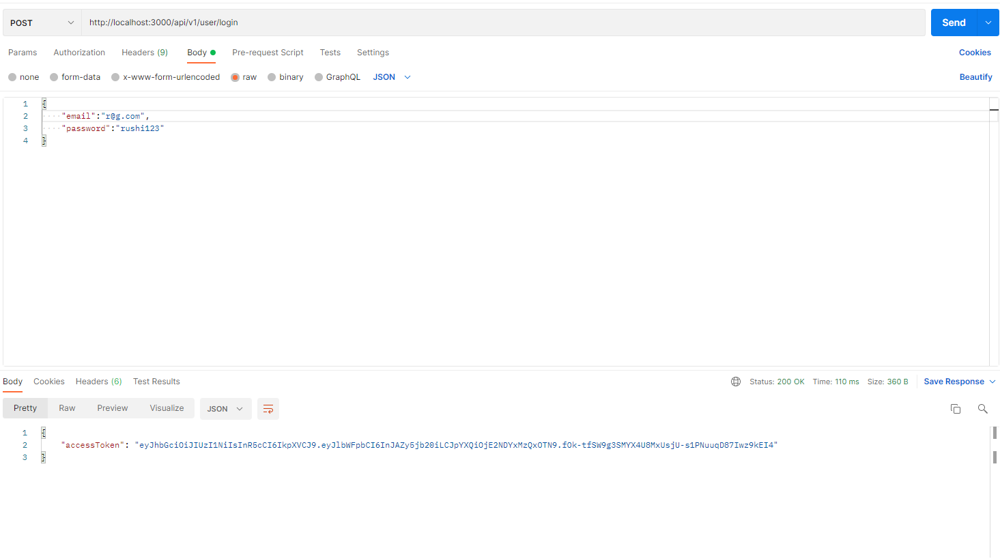
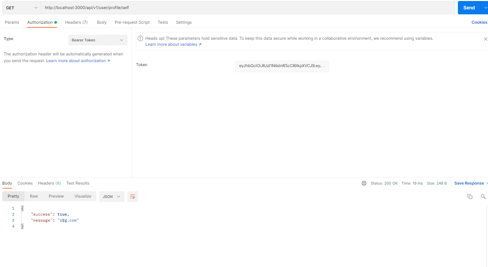
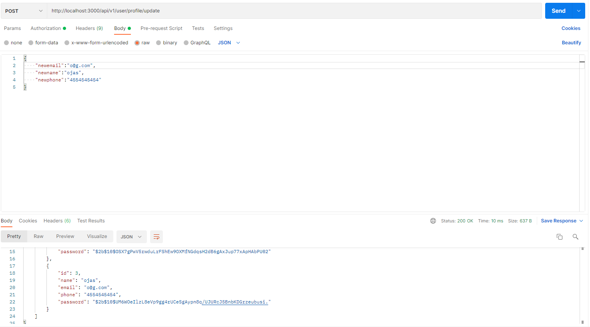
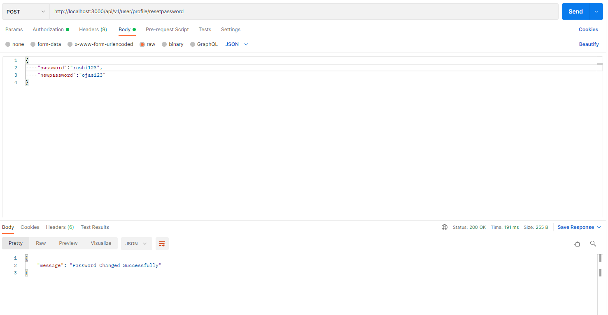

# NodeAssignment

There are already 2 existing users:
1. email: t@g.com password: tejas123
2. email: k@g.com password: keyur123

### Register User
http://localhost:3000/api/v1/user/register

### Login User
http://localhost:3000/api/v1/user/login

### Get All Users
http://localhost:3000/api/v1/user

### Get Own Info
http://localhost:3000/api/v1/user/profile/self

### Update Profile
http://localhost:3000/api/v1/user/profile/update

### Change Password
http://localhost:3000/api/v1/user/profile/resetpassword

